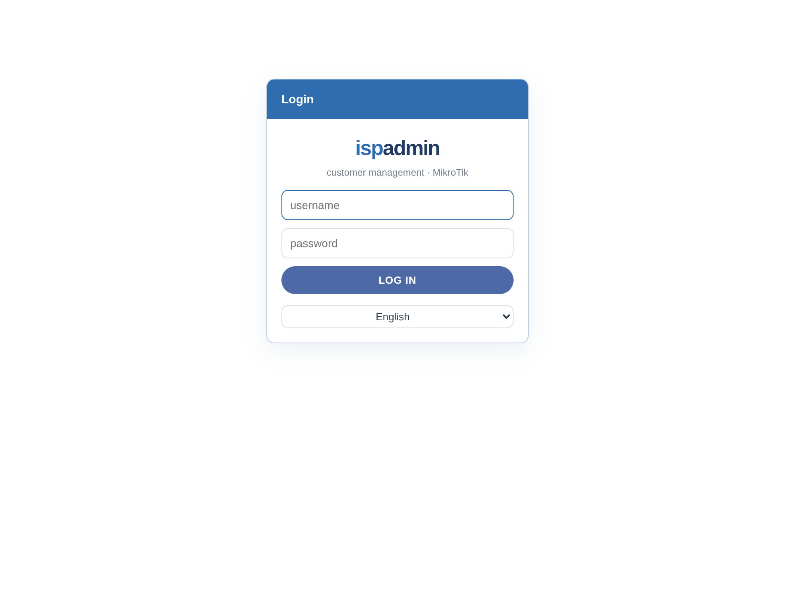
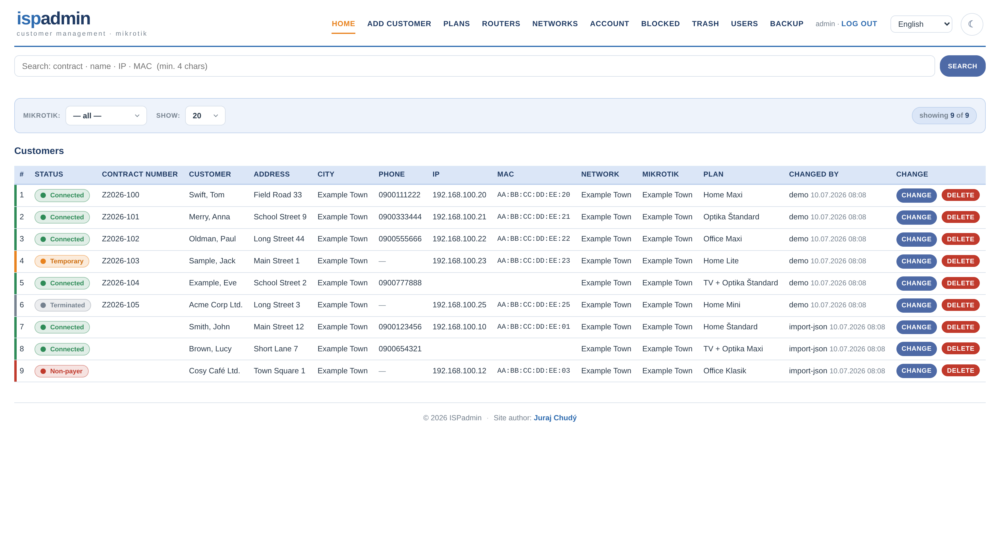
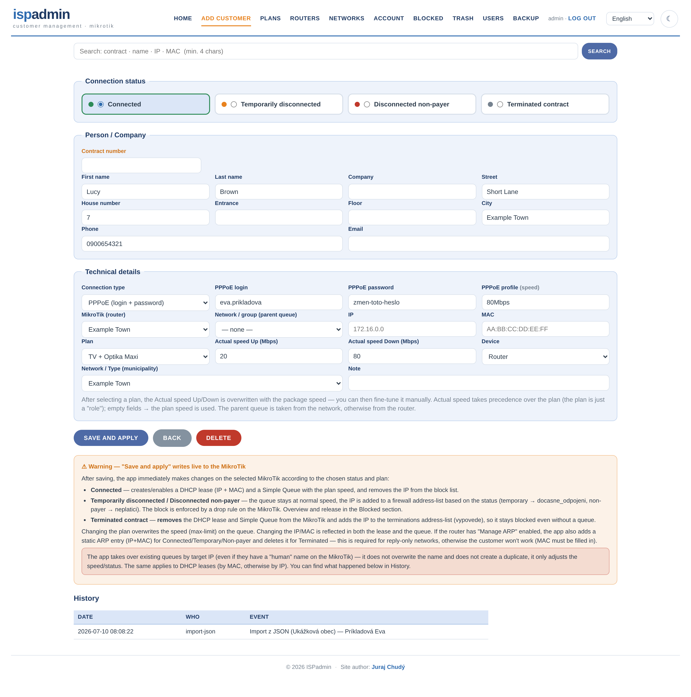
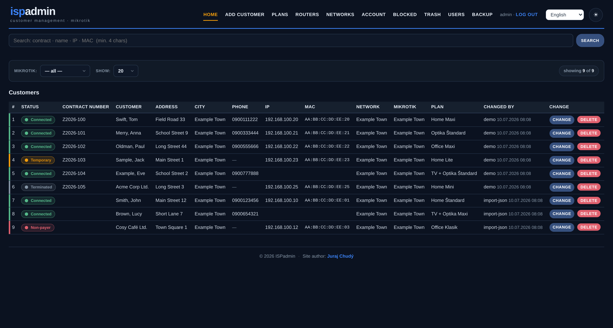

# ISPadmin

Lightweight web-based customer management for small ISPs, built on top of the **MikroTik RouterOS API**. Multi-site: when you save a customer, the app automatically writes the DHCP lease + Simple Queue (or PPP secret for PPPoE) to the selected MikroTik, based on the customer's status and plan (speed profile).

**Plain PHP + SQLite/MySQL. No framework, no dependencies.** Up and running in minutes.

## Features

- Customer management: name, address, contact, contract, IP/MAC, plan, status, notes, change history
- Automatic MikroTik provisioning via RouterOS API — DHCP leases, Simple Queues, ARP, firewall address-lists, PPP secrets (PPPoE)
- Multi-router / multi-site: every customer belongs to a specific MikroTik and network
- Plans (speed profiles) with aggregation — `max-limit` and `limit-at` are calculated automatically
- Customer statuses: connected / temporarily disconnected / non-payer / contract terminated — the app blocks automatically based on status (address-list + speed throttling)
- Users and roles (administrator > admin > user), password management, trash bin, audit log
- One-click database backup + FTP/FTPS upload, restore from backup
- Optional geo-blocking of the login (allow selected countries only, via Cloudflare header or offline CIDR lists)
- **10 languages** — language picker on the login screen and in the header (Slovak, Czech, English, German, Polish, Hungarian, Romanian, Ukrainian, Latvian, Russian)
- Light / dark theme, responsive UI

## Screenshots

| | |
|---|---|
|  |  |
| Login with language picker | Customer dashboard |
|  |  |
| Customer form (PPPoE) | Dark mode |

More: [Slovak UI](docs/screenshots/home-sk.png) · [Plans](docs/screenshots/programs.png) · [Routers](docs/screenshots/routers.png) · [Networks](docs/screenshots/networks.png) · [Backup](docs/screenshots/backup.png) · [Users](docs/screenshots/users.png)

## Requirements

- PHP 8.1+ with extensions: `pdo` + `pdo_sqlite` (or `pdo_mysql`), `openssl` (for api-ssl), optionally `curl`/`ftp` (FTP backups)
- MikroTik RouterOS with the API service enabled (port 8728, or api-ssl 8729)
- Or just Docker + docker compose — nothing else needed

## Quick start (testing, SQLite)

```bash
git clone https://github.com/MikrotikExe/ispadmin.git
cd ispadmin
php -S 0.0.0.0:8000 -t public
```

Open `http://server:8000/login.php`

**Default login: `admin` / `changeme`** — change the password right after logging in (Account section).

The database is created automatically on first run in `data/ispadmin.sqlite`, seeded with example plans (edit them in the UI to match your own offer).

## Running with Docker (recommended)

```bash
git clone https://github.com/MikrotikExe/ispadmin.git
cd ispadmin
docker compose up -d --build
```

- The container runs with `network_mode: host`, so it reaches your MikroTiks exactly like the host server does (including WireGuard/LAN routes).
- Apache listens only on `127.0.0.1:8090` — expose it through an nginx reverse proxy; a sample config is in [`docker/nginx-proxy.conf`](docker/nginx-proxy.conf) (add TLS with certbot).
- The SQLite database is stored in the `ispadmin-data` volume (persists across rebuilds).

## Production (MySQL)

1. In `config.php` set `'driver' => 'mysql'` and fill in the credentials (or use the `DB_HOST`, `DB_NAME`, `DB_USER`, `DB_PASS` environment variables).
2. Create the database and import the schema:

```bash
mysql -u root -p -e "CREATE DATABASE ispadmin CHARACTER SET utf8mb4"
mysql -u ispadmin -p ispadmin < schema.sql
```

3. Point the DocumentRoot at the `public/` directory — `config.php`, `lib/`, `lang/` and `data/` stay outside the web root. On classic Apache shared hosting the bundled root `.htaccess` handles this.

## MikroTik setup

Enable the API on every router:

```
/ip service enable api
```

(port 8728; for SSL enable `api-ssl` on 8729 and turn on `use_ssl` for the router in the app)

Create an API account with permissions for: `dhcp-server/lease`, `queue`, `firewall/address-list`, `ppp/secret`, `system`. You enter the API credentials in the **Routers** section of the UI — they are stored only in your own database.

To actually block non-payers, add a firewall rule on the router:

```
/ip firewall filter add chain=forward src-address-list=neplatici action=drop
```

Address-list names are configurable in `config.php` (`block_lists`).

## Status logic

| Status | What the app does on the MikroTik |
|---|---|
| Connected | lease + queue (enabled), IP removed from block list |
| Temporarily disconnected | lease stays, queue throttled/disabled, IP added to address-list |
| Non-payer | same as temporary, different address-list |
| Contract terminated | deletes lease + queue + address-list entry |

PPPoE customers are managed through `/ppp/secret` (login, password, profile) instead of lease/queue.

## Plans and aggregation

Per-user Simple Queue:

- `max-limit` = user UL/DL (upload/download, in kbit)
- `limit-at` = `max-limit / aggregation` (guaranteed share)

A plan with no speed set (e.g. IPTV, GPON) creates only the lease, no queue.

## Importing existing customers

Prepare a JSON file following [`example_data.json`](example_data.json) and run:

```bash
php import_json.php my_site.json          # preview, writes nothing
php import_json.php my_site.json --apply  # real import
```

The import is idempotent — existing customers (same IP or PPPoE login) are skipped, and nothing is changed on the MikroTik.

## CLI helper scripts

| Script | Purpose |
|---|---|
| `import_json.php` | import a router, its networks and customers from JSON |
| `pull_speeds.php` | fill in customers' real speeds from Simple Queues on the MikroTik (read-only) |
| `set_siet.php` | bulk-set the "Network" field on customers |
| `fix_encoding.php` | fix diacritics (CP1250 escapes from RouterOS) in already imported data |
| `update_geoip.php` | download country CIDR lists for geo-blocking (cron-friendly) |

All of them run in preview mode until you add `--apply`.

## Languages / adding a translation

The UI ships in 10 languages; users pick their language on the login screen (stored in a cookie, auto-detected from the browser on first visit). Slovak is the source language, English is the fallback for missing strings.

To add or improve a language:

1. Copy `lang/en.php` to `lang/xx.php` and translate the values (keys stay in Slovak).
2. Add the code and native name to `LANGS` in `lib/lang.php`.
3. Check completeness: `php lang/verify.php xx` (uses `lang/keys.txt`, verifies keys, `%s` placeholders and inline HTML).

Pull requests with new languages are welcome.

## Geo-blocking (optional)

Access can be limited to selected countries. Enable it with the `ISPADMIN_GEO_ENFORCE=1` env variable (disabled by default in `docker-compose.yml` so you can't lock yourself out). It works via the Cloudflare `CF-IPCountry` header, or fully offline via CIDR lists (`update_geoip.php`). Add your own IPs to `ISPADMIN_GEO_ALLOW_IPS` as a safety net.

## Logo and branding

The header logo is text-based and configured in `config.php`:

```php
'brand_pre'  => 'isp',      // first (blue) part
'brand_post' => 'admin',    // second (dark) part
'tagline'    => 'customer management · MikroTik',
```

A default SVG logo is included in `public/assets/logo.svg` — feel free to modify it or replace it with your own.

## Security notes

- **Change the default password immediately** after the first login (`admin` / `changeme`).
- `config.php`, `lib/`, `lang/` and `data/` must not be reachable from the web — both Docker and the bundled `.htaccess` take care of this.
- Router API credentials and customer data live only in your own database (`data/` is in `.gitignore`) — never commit them.
- Run the app behind HTTPS (certbot + nginx proxy), ideally on an internal network / behind a VPN.

## TODO / possible extensions

- Parent queue / queue-tree for shared group caps
- IPv6 prefix delegation
- Bulk re-sync of all customers to a router
- Per-field audit log

## License

MIT — see [LICENSE](LICENSE). Use at your own risk; test everything on a lab router before deploying to production.

---

Author: [Juraj Chudý](https://jurajchudy.sk)
